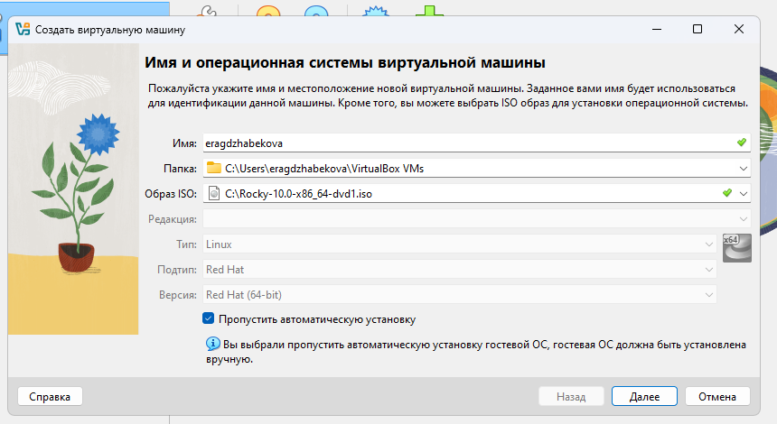
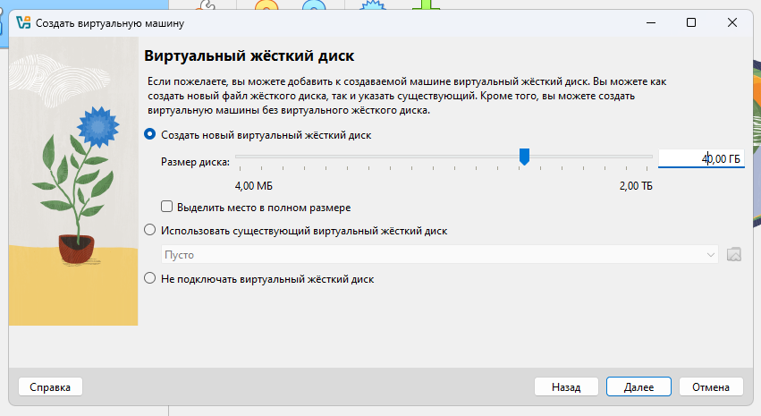
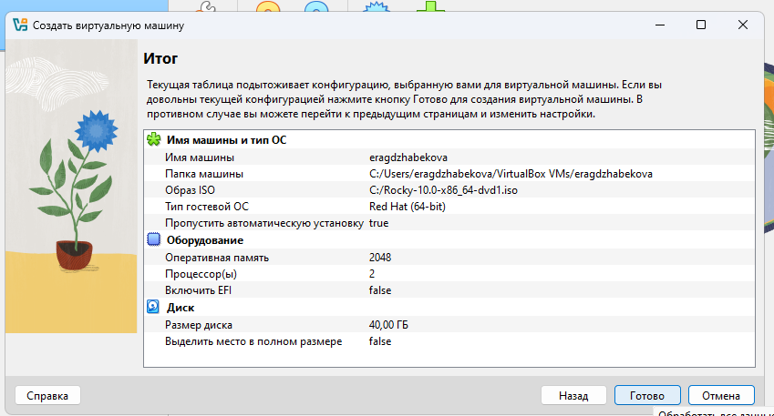
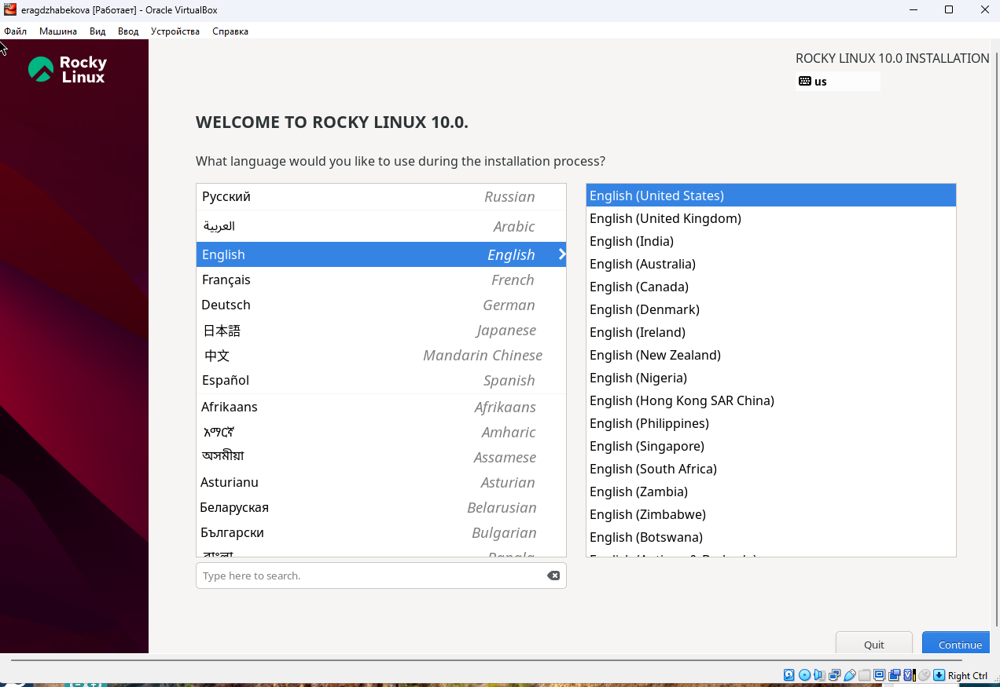
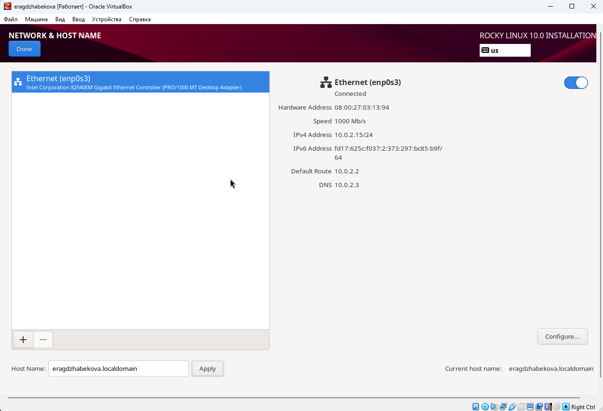
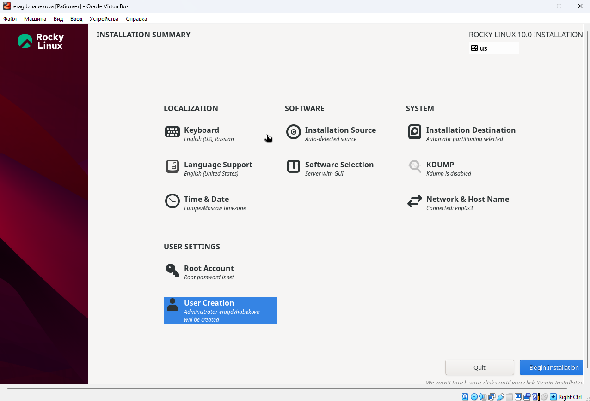
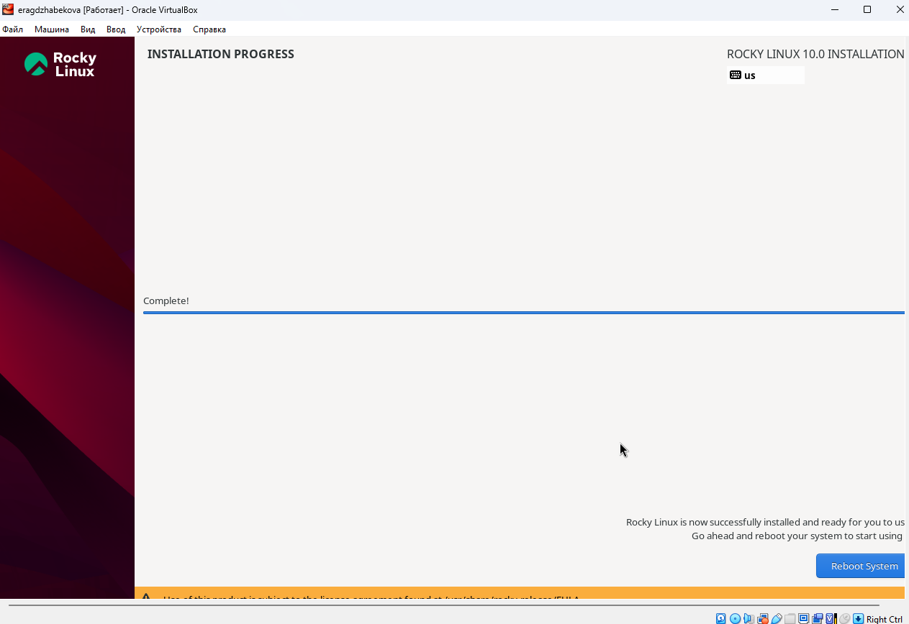
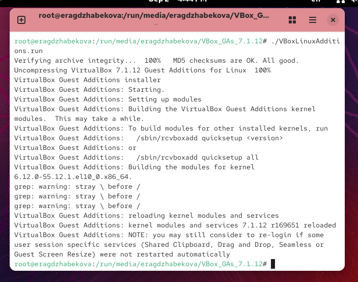
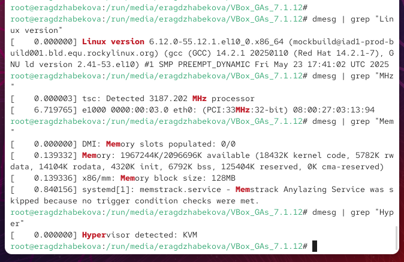
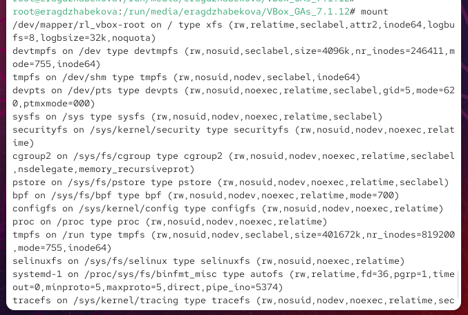

---
## Front matter
lang: ru-RU
title: Презентация по лабораторной работе №1
subtitle: Установка и настройка ОС Rocky Linux в виртуальной машине
author:
  - Агджабекова Эся Рустамовна
institute:
  - Российский университет дружбы народов, Москва, Россия
date: 2 сентября 2025

## i18n babel
babel-lang: russian
babel-otherlangs: english

## Formatting pdf
toc: false
slide_level: 2
aspectratio: 169
section-titles: true
theme: metropolis
header-includes:
 - \metroset{progressbar=frametitle,sectionpage=progressbar,numbering=fraction}
---

# Цели и задачи работы

## Цель работы

Изучить процесс установки Rocky Linux на виртуальную машину и освоить базовые навыки администрирования.

# Ход выполнения работы

## Создание виртуальной машины

{ #fig:001 width=70% }

## Настройка диска

{ #fig:002 width=70% }

## Итоговые параметры

{ #fig:003 width=70% }

## Выбор языка интерфейса

{ #fig:004 width=70% }

## Настройка сети и имени узла

{ #fig:005 width=70% }

## Параметры установки

{ #fig:006 width=70% }

## Процесс установки

{ #fig:007 width=70% }

## Установка Guest Additions

{ #fig:008 width=70% }

## Системные характеристики

{ #fig:009 width=70% }

## Смонтированные файловые системы

{ #fig:010 width=70% }

# Итоги работы

## Вывод

В ходе работы установлена ОС Rocky Linux в виртуальной среде, выполнена настройка сети, локализации и добавление гостевых дополнений. Получены практические навыки администрирования и анализа системных сообщений.
