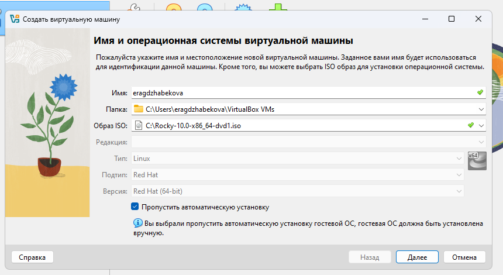
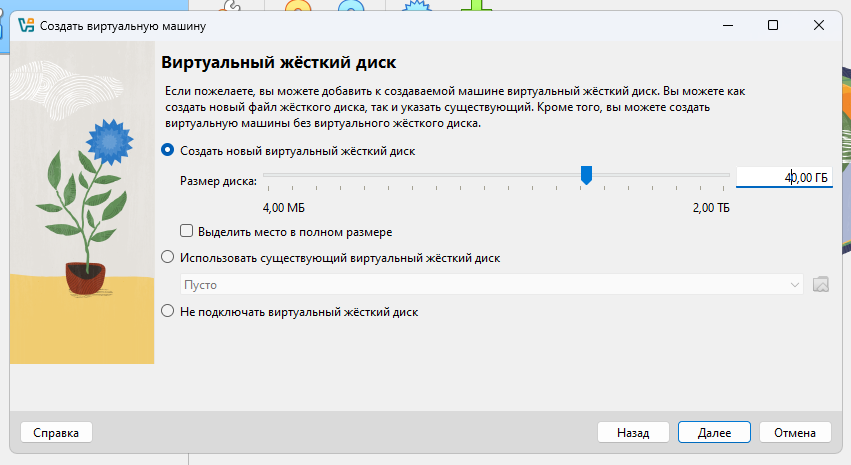
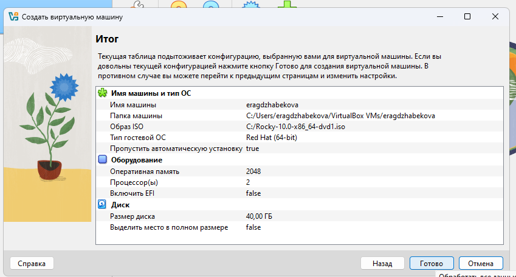
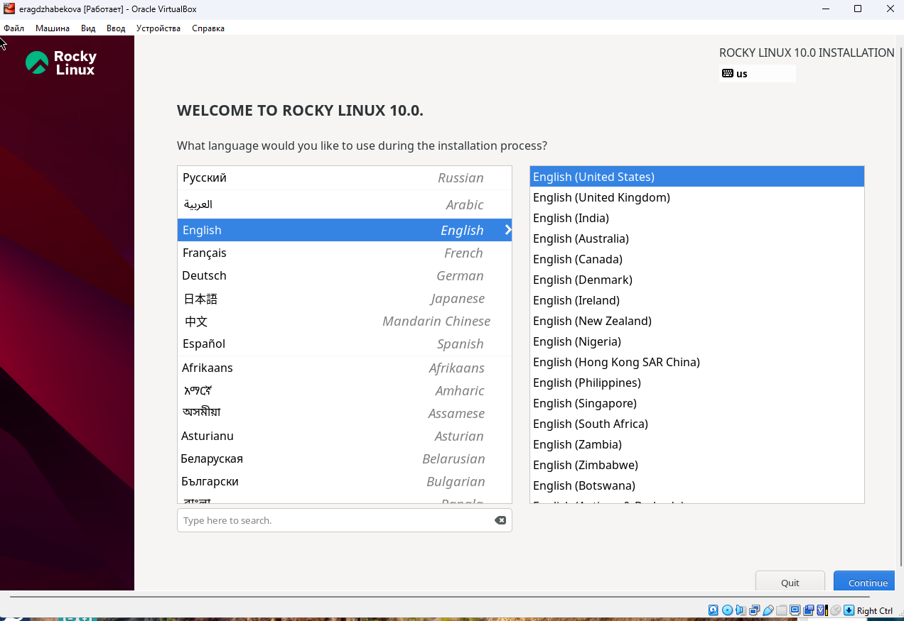
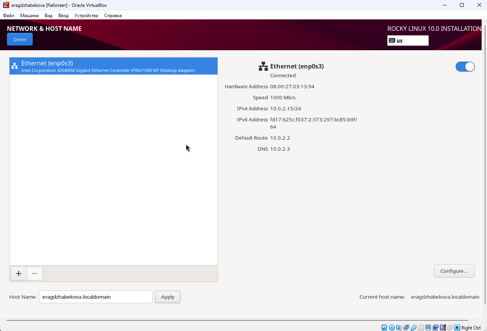
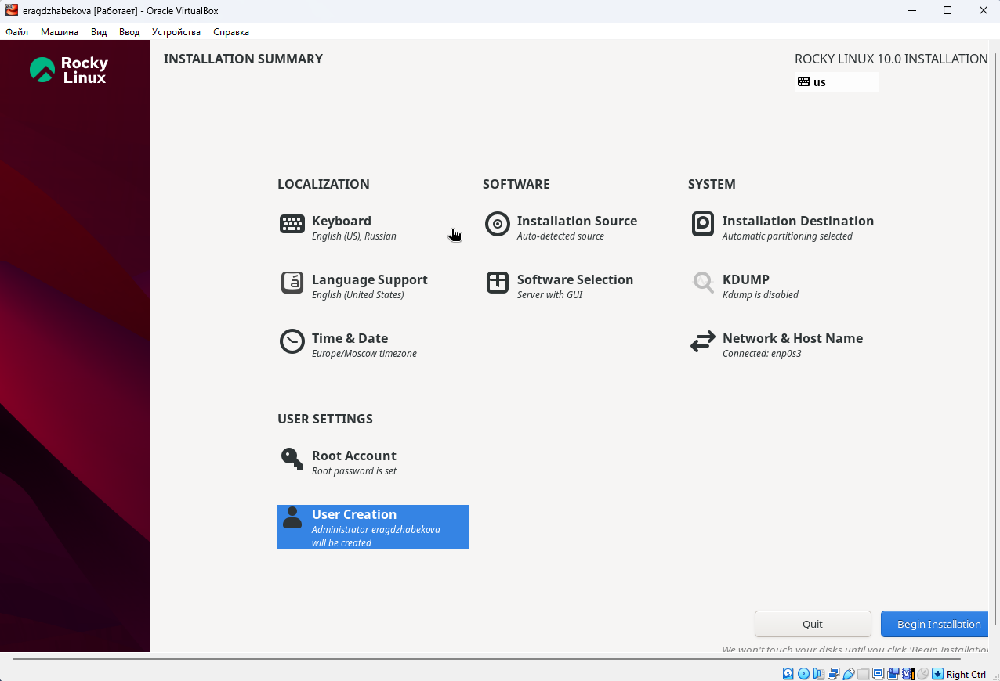
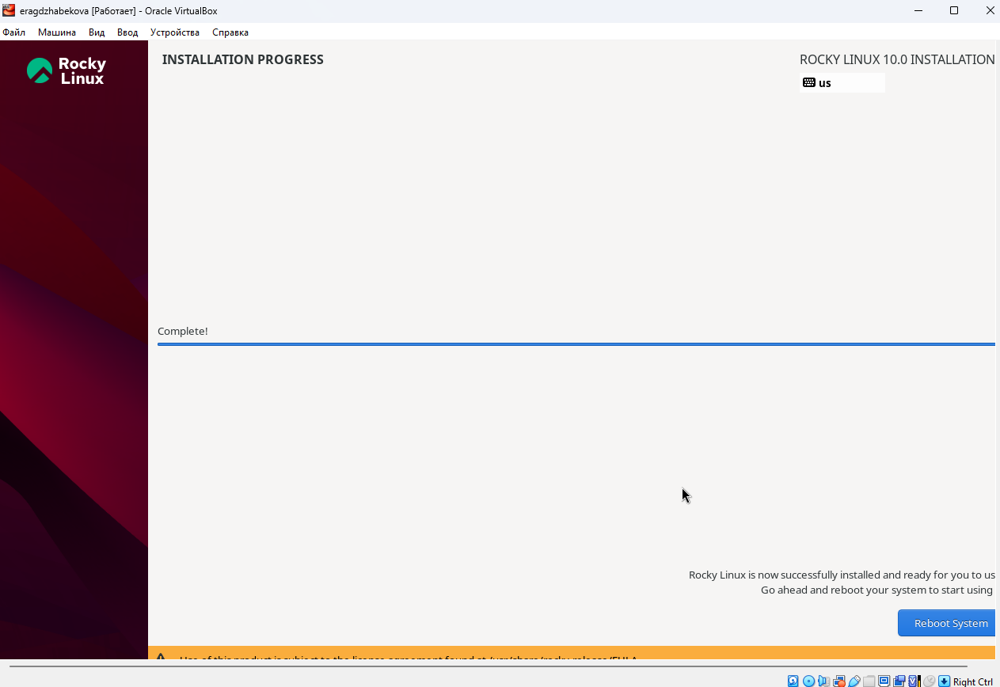
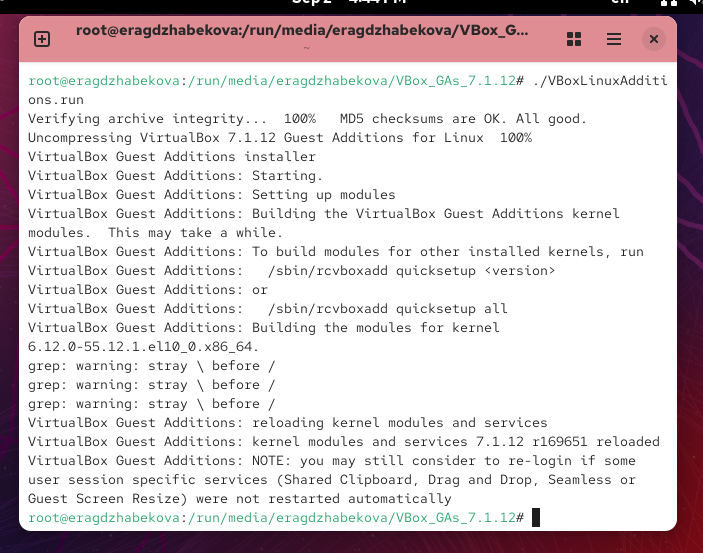
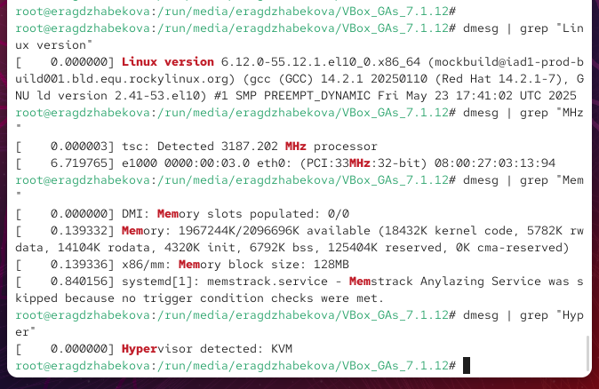
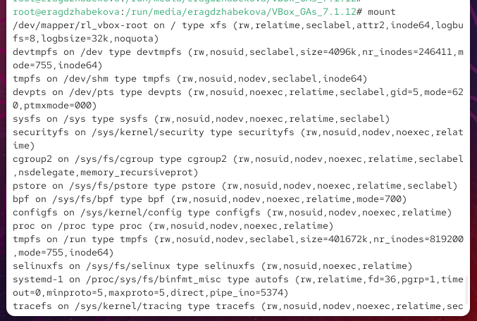

---
## Front matter
title: "Отчёт по лабораторной работе №1"
subtitle: "Установка и настройка ОС Rocky Linux в виртуальной машине"
author: "Агджабекова Эся Рустамовна"

## Generic otions
lang: ru-RU
toc-title: "Содержание"

## Bibliography
bibliography: bib/cite.bib
csl: pandoc/csl/gost-r-7-0-5-2008-numeric.csl

## Pdf output format
toc: true
toc-depth: 2
lof: true
lot: true
fontsize: 12pt
linestretch: 1.5
papersize: a4
documentclass: scrreprt
## I18n polyglossia
polyglossia-lang:
  name: russian
  options:
    - spelling=modern
    - babelshorthands=true
polyglossia-otherlangs:
  name: english
## I18n babel
babel-lang: russian
babel-otherlangs: english
## Fonts
mainfont: IBM Plex Serif
romanfont: IBM Plex Serif
sansfont: IBM Plex Sans
monofont: IBM Plex Mono
mathfont: STIX Two Math
mainfontoptions: Ligatures=Common,Ligatures=TeX,Scale=0.94
romanfontoptions: Ligatures=Common,Ligatures=TeX,Scale=0.94
sansfontoptions: Ligatures=Common,Ligatures=TeX,Scale=MatchLowercase,Scale=0.94
monofontoptions: Scale=MatchLowercase,Scale=0.94,FakeStretch=0.9
mathfontoptions:
## Biblatex
biblatex: true
biblio-style: "gost-numeric"
biblatexoptions:
  - parentracker=true
  - backend=biber
  - hyperref=auto
  - language=auto
  - autolang=other*
  - citestyle=gost-numeric
## Pandoc-crossref LaTeX customization
figureTitle: "Рис."
tableTitle: "Таблица"
listingTitle: "Листинг"
lofTitle: "Список иллюстраций"
lotTitle: "Список таблиц"
lolTitle: "Листинги"
## Misc options
indent: true
header-includes:
  - \usepackage{indentfirst}
  - \usepackage{float}
  - \floatplacement{figure}{H}
---

# Цель работы

Изучить процесс развертывания дистрибутива Rocky Linux в виртуальной среде VirtualBox и освоить базовые приёмы администрирования установленной системы.

# Ход выполнения работы

1. Создана новая виртуальная машина в VirtualBox. При создании указаны имя, путь для хранения файлов и ISO-образ установщика (см. рис. [@fig:001]).

{ #fig:001 width=70% }

2. Для виртуальной машины задан виртуальный жёсткий диск объёмом 40 ГБ (см. рис. [@fig:002]).

{ #fig:002 width=70% }

3. Итоговые параметры машины включают 2 ГБ оперативной памяти, 2 процессора и диск 40 ГБ (см. рис. [@fig:003]).

{ #fig:003 width=70% }

4. При запуске установщика выбрала язык интерфейса — English (United States) (см. рис. [@fig:004]).

{ #fig:004 width=70% }

5. В параметрах сети включила адаптер и задала имя хоста `eragdzhabekova.localdomain` (см. рис. [@fig:005]).

{ #fig:005 width=70% }

6. В настройках установки указаны параметры локализации, выбор программного окружения (Server with GUI), часовой пояс и создание учётной записи администратора (см. рис. [@fig:006]).

{ #fig:006 width=70% }

7. Запустила установку системы и дождалась её завершения (см. рис. [@fig:007]).

{ #fig:007 width=70% }

8. После загрузки ОС установила гостевые дополнения VirtualBox через терминал (см. рис. [@fig:008]).

{ #fig:008 width=70% }

# Анализ системных сообщений

С помощью команды `dmesg` проанализировала процесс загрузки и выделила важные характеристики:

- Версия ядра: **6.12.0-55.12.1.el10.0.x86_64**
- Частота CPU: **3187.202 MHz**
- Объём доступной памяти: **~2 ГБ**
- Обнаруженный гипервизор: **KVM**
- Тип файловой системы корневого раздела: **XFS**
- Последовательность монтирования файловых систем (см. рис. [@fig:009], [@fig:010]).

{ #fig:009 width=70% }

{ #fig:010 width=70% }

# Контрольные вопросы

1. **Команды Linux:**
   - справка: `man`, `--help`
   - перемещение: `cd`
   - просмотр содержимого: `ls`, `dir`
   - размер каталога и файлов: `ls -lh`
   - создание/удаление: `mkdir`, `rmdir`, `touch`, `rm`
   - права доступа: `chmod`
   - история команд: `history`

2. **Учётная запись пользователя** хранит: логин, пароль (хэш), UID, GID, имя/комментарий, домашний каталог, оболочку. Эти сведения находятся в файле `/etc/passwd`.

3. **Файловые системы:**
   - FAT — простая и совместимая, но ограничена;
   - NTFS — поддержка ACL и больших файлов;
   - Ext2/3/4 — классические Linux-системы;
   - XFS — эффективна для больших разделов и файлов.

4. **Список смонтированных ФС** выводят команды `mount` или `df -h`.

5. **Удаление зависшего процесса:** определить PID (`ps`, `top`) и завершить `kill PID`.

# Заключение

В результате лабораторной работы на виртуальной машине установлена Rocky Linux, выполнена базовая настройка сети и локализации. Также был проведён анализ системных сообщений загрузки и изучены основные команды Linux, необходимые для администрирования. Получены практические навыки работы с виртуализацией и управления системой.
