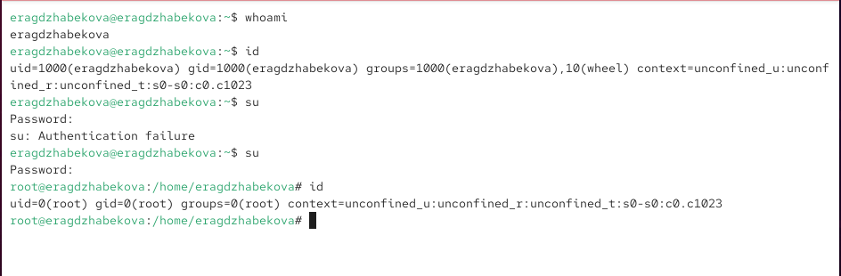
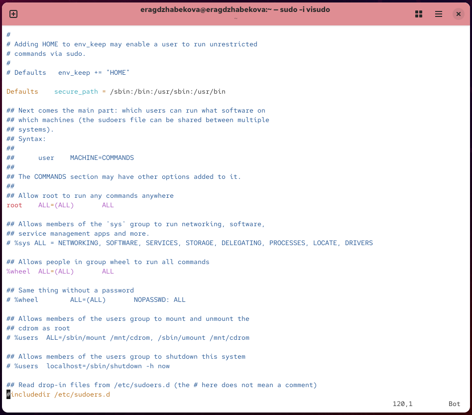
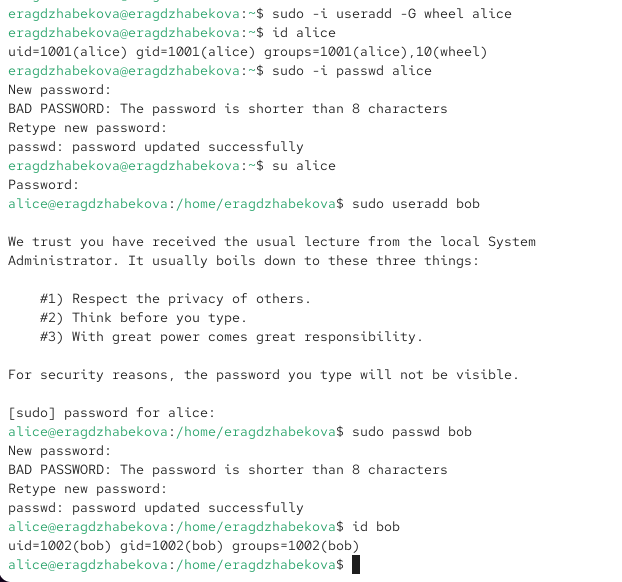
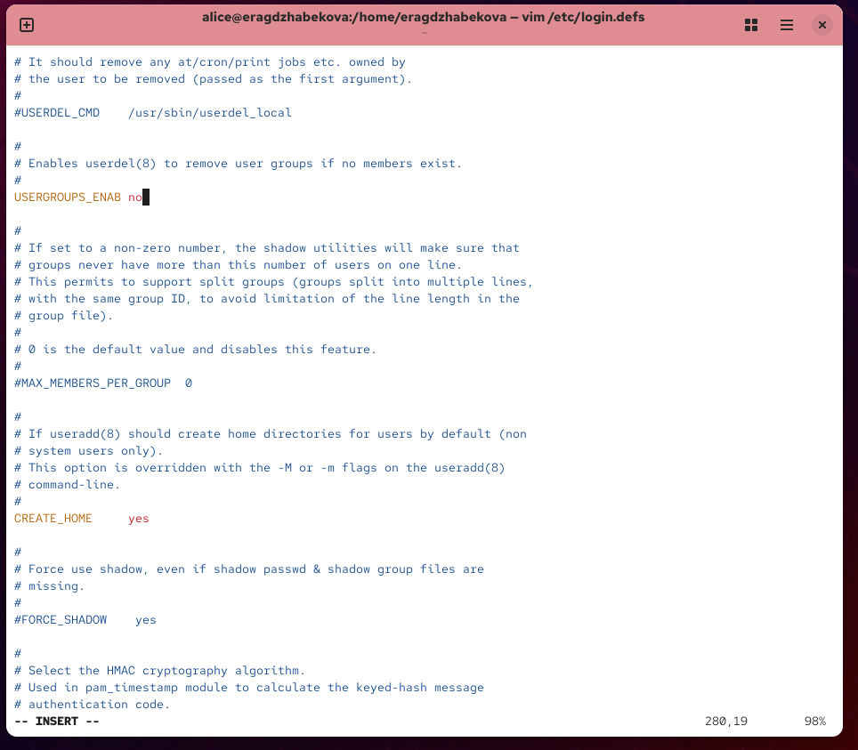
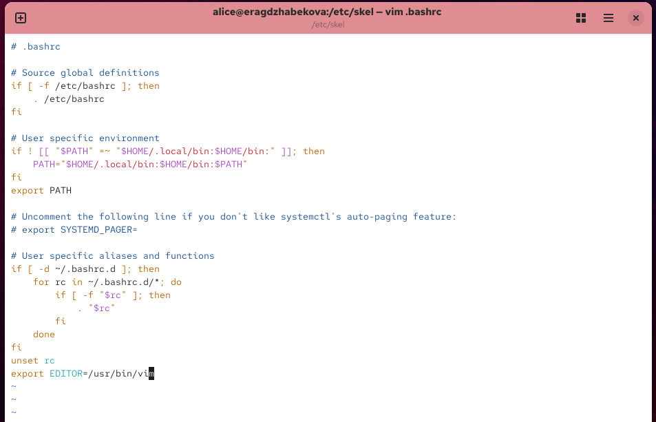
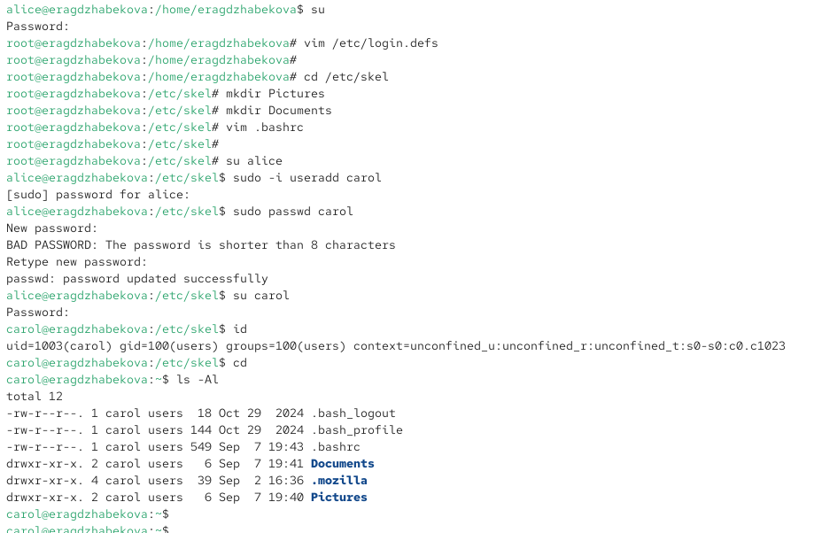
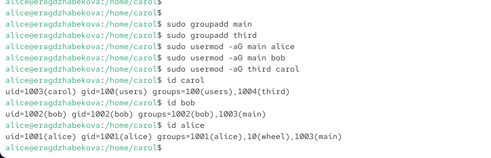

---
## Front matter
lang: ru-RU
title: Презентация по лабораторной работе №2
subtitle: Управление пользователями и группами
author:
  - Агджабекова Эся Рустамовна
institute:
  - Российский университет дружбы народов, Москва, Россия
date: 8 сентября 2025

## i18n babel
babel-lang: russian
babel-otherlangs: english

## Formatting pdf
toc: false
slide_level: 2
aspectratio: 169
section-titles: true
theme: metropolis
header-includes:
 - \metroset{progressbar=frametitle,sectionpage=progressbar,numbering=fraction}
---

# Цели и задачи работы

## Цель работы

Получить практические навыки работы с учётными записями пользователей и группами в ОС Linux, изучить механизмы разграничения доступа и администрирования.

# Ход выполнения работы

## Определение текущего пользователя

{ #fig:001 width=70% }

## Работа с root и sudoers

{ #fig:002 width=70% }

## Создание пользователей alice и bob

{ #fig:003 width=70% }

## Настройка параметров login.defs

{ #fig:004 width=70% }

## Изменение скелетного каталога и .bashrc

{ #fig:005 width=70% }

## Создание пользователя carol

{ #fig:006 width=70% }

## Настройка параметров пароля carol

{ #fig:007 width=70% }

## Создание и проверка групп

{ #fig:008 width=70% }

# Итоги работы

## Вывод

В ходе работы были освоены приёмы управления пользователями и группами в Linux:  
создание учётных записей, настройка параметров паролей, изменение конфигурационных файлов, работа с группами и sudo. Получены практические навыки администрирования.
