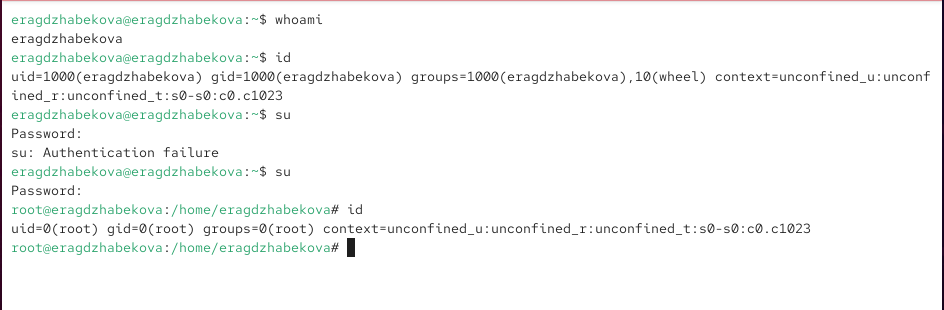
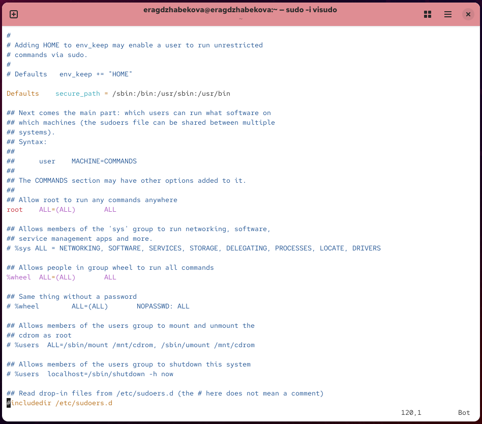
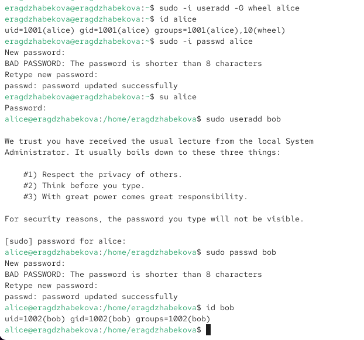
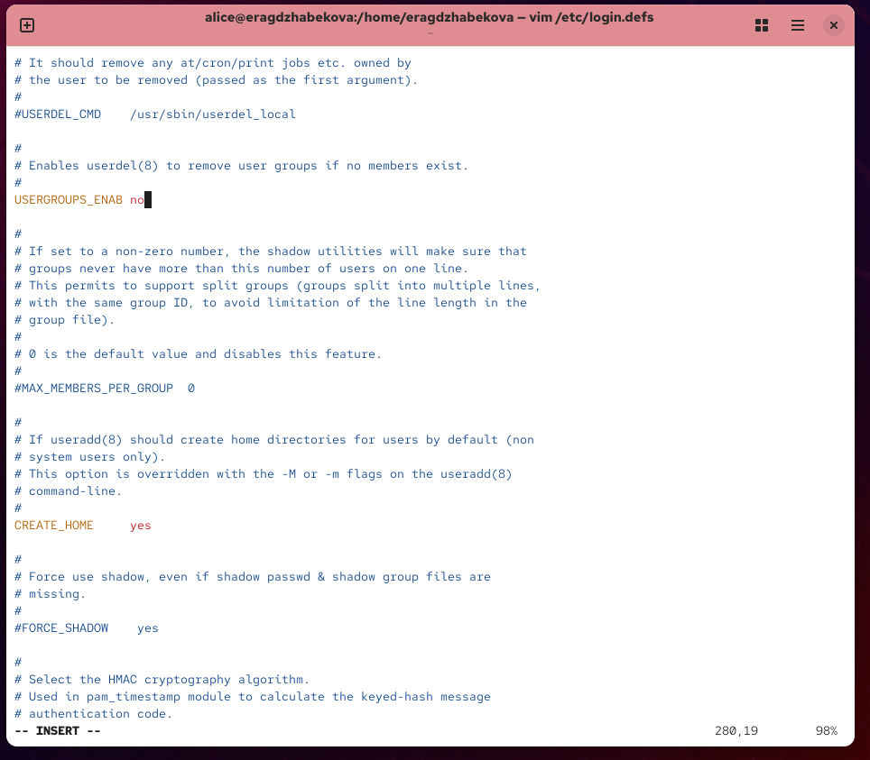
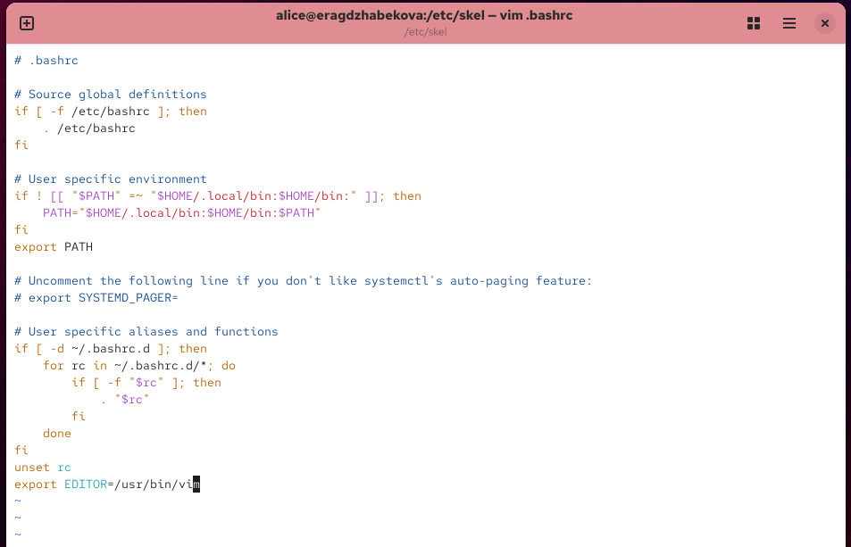
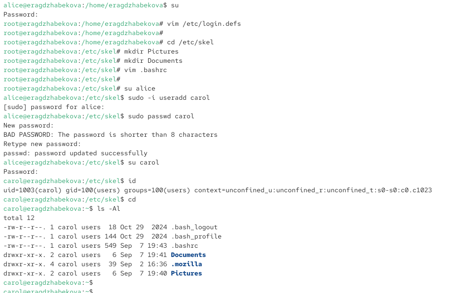
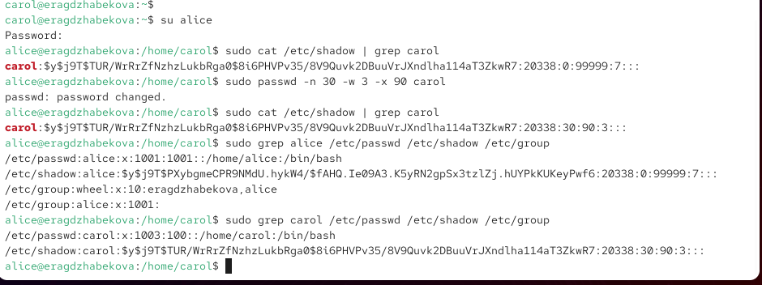

---
## Front matter
title: "Отчёт по лабораторной работе №2"
subtitle: "Управление пользователями и группами"
author: "Агджабекова Эся Рустамовна"

## Generic otions
lang: ru-RU
toc-title: "Содержание"

## Bibliography
bibliography: bib/cite.bib
csl: pandoc/csl/gost-r-7-0-5-2008-numeric.csl

## Pdf output format
toc: true
toc-depth: 2
lof: true
lot: true
fontsize: 12pt
linestretch: 1.5
papersize: a4
documentclass: scrreprt
## I18n polyglossia
polyglossia-lang:
  name: russian
  options:
    - spelling=modern
    - babelshorthands=true
polyglossia-otherlangs:
  name: english
## I18n babel
babel-lang: russian
babel-otherlangs: english
## Fonts
mainfont: IBM Plex Serif
romanfont: IBM Plex Serif
sansfont: IBM Plex Sans
monofont: IBM Plex Mono
mathfont: STIX Two Math
mainfontoptions: Ligatures=Common,Ligatures=TeX,Scale=0.94
romanfontoptions: Ligatures=Common,Ligatures=TeX,Scale=0.94
sansfontoptions: Ligatures=Common,Ligatures=TeX,Scale=MatchLowercase,Scale=0.94
monofontoptions: Scale=MatchLowercase,Scale=0.94,FakeStretch=0.9
mathfontoptions:
## Biblatex
biblatex: true
biblio-style: "gost-numeric"
biblatexoptions:
  - parentracker=true
  - backend=biber
  - hyperref=auto
  - language=auto
  - autolang=other*
  - citestyle=gost-numeric
## Pandoc-crossref LaTeX customization
figureTitle: "Рис."
tableTitle: "Таблица"
listingTitle: "Листинг"
lofTitle: "Список иллюстраций"
lotTitle: "Список таблиц"
lolTitle: "Листинги"
## Misc options
indent: true
header-includes:
  - \usepackage{indentfirst}
  - \usepackage{float}
  - \floatplacement{figure}{H}
---

# Цель работы

Получить практические навыки работы с учётными записями пользователей и группами в операционной системе Linux, а также изучить механизмы разграничения доступа и администрирования.

# Ход выполнения работы

## Переключение учётных записей пользователей

1. Определена текущая учётная запись командой `whoami` и просмотрена дополнительная информация с помощью `id` (см. рис. [@fig:001]).

{ #fig:001 width=70% }

2. Переключение на root выполнено командой `su`, после чего повторно вызвана команда `id`.  
3. Просмотр содержимого файла `/etc/sudoers` с помощью `visudo` (оба действия на одном скрине, см. рис. [@fig:002]).

{ #fig:002 width=70% }

4. Создан пользователь **alice** с включением в группу `wheel`, проверено его наличие в группе.  
5. Задан пароль пользователю **alice** и выполнен вход от его имени.  
6. Создан пользователь **bob**, ему назначен пароль и просмотрено членство в группах (всё это на одном скрине, см. рис. [@fig:003]).

{ #fig:003 width=70% }

## Создание учётных записей пользователей

1. Проверен и изменён файл `/etc/login.defs`: включено создание домашнего каталога (`CREATE_HOME yes`) и отключено создание одноимённых групп (`USERGROUPS_ENAB no`) (см. рис. [@fig:004]).

{ #fig:004 width=70% }

2. В каталог `/etc/skel` добавлены директории `Pictures` и `Documents`, а также изменён файл `.bashrc` для указания редактора по умолчанию (см. рис. [@fig:005]).

{ #fig:005 width=70% }

3. Создан пользователь **carol**, проверен его домашний каталог и членство в группах (см. рис. [@fig:006]).

{ #fig:006 width=70% }

4. Изменены свойства пароля пользователя carol: минимальный срок — 30 дней, срок действия — 90 дней, предупреждение — за 3 дня (см. рис. [@fig:007]).

{ #fig:007 width=70% }

## Работа с группами

1. Созданы группы `main` и `third`.  
2. Пользователи добавлены в группы: alice и bob — в `main`, carol — в `third`.  
3. Проверено членство пользователей в группах с помощью `id` и `groups` (см. рис. [@fig:008]).

{ #fig:008 width=70% }

# Контрольные вопросы

1. **Как узнать UID и группы пользователя?**
   Команды: `id`, `groups`, `id -u`, `id -G`.

2. **UID пользователя root?**
   Root всегда имеет UID = 0. Проверка: `id root`.

3. **Различие su и sudo?**
   `su` полностью переключает пользователя, `sudo` позволяет выполнять отдельные команды с правами администратора.

4. **Где задаются параметры sudo?**
   В файле `/etc/sudoers`.

5. **Безопасное редактирование sudoers?**
   Использовать `visudo`, так как он проверяет синтаксис.

6. **Какая группа для полного доступа через sudo?**
   `wheel`.

7. **Файлы для настройки параметров новых пользователей:** `/etc/login.defs`, `/etc/default/useradd`, `/etc/skel/`.

8. **Где хранится информация о группах?**
   В `/etc/passwd` (основная), `/etc/group` (дополнительные). Пример: alice состоит в `wheel`, `main`.

9. **Команды для изменения свойств пароля:** `passwd`, `chage`.

10. **Изменение файла /etc/group?**
    Прямая правка не рекомендуется, лучше использовать `groupadd`, `groupdel`, `usermod`.

# Заключение

В ходе лабораторной работы были изучены принципы управления пользователями и группами в Linux. Созданы новые учётные записи, изменены параметры паролей, настроены группы пользователей. Получены практические навыки администрирования, включая работу с файлами `/etc/passwd`, `/etc/shadow`, `/etc/group` и настройку sudo.
