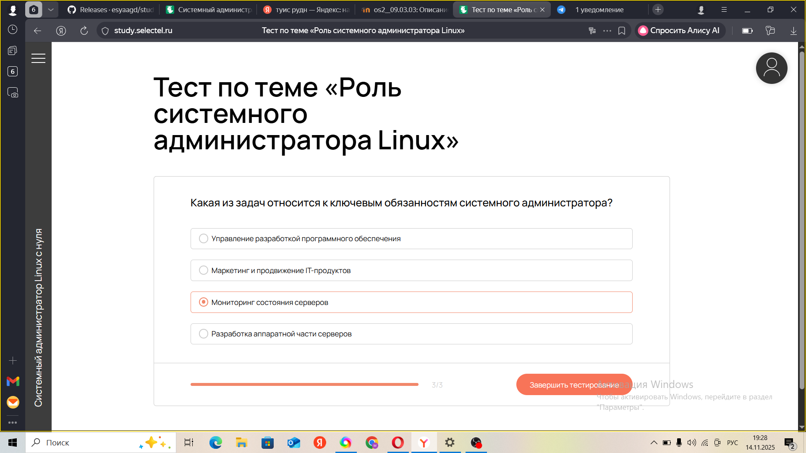
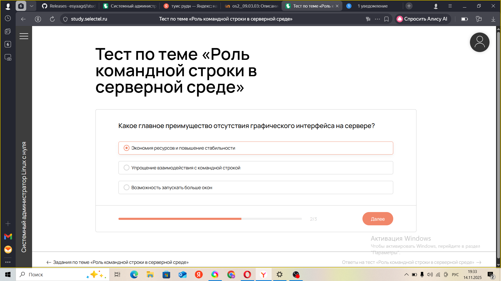
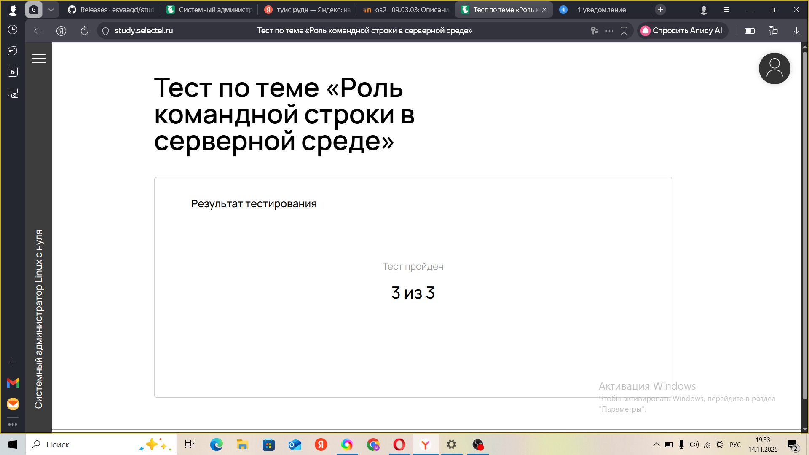
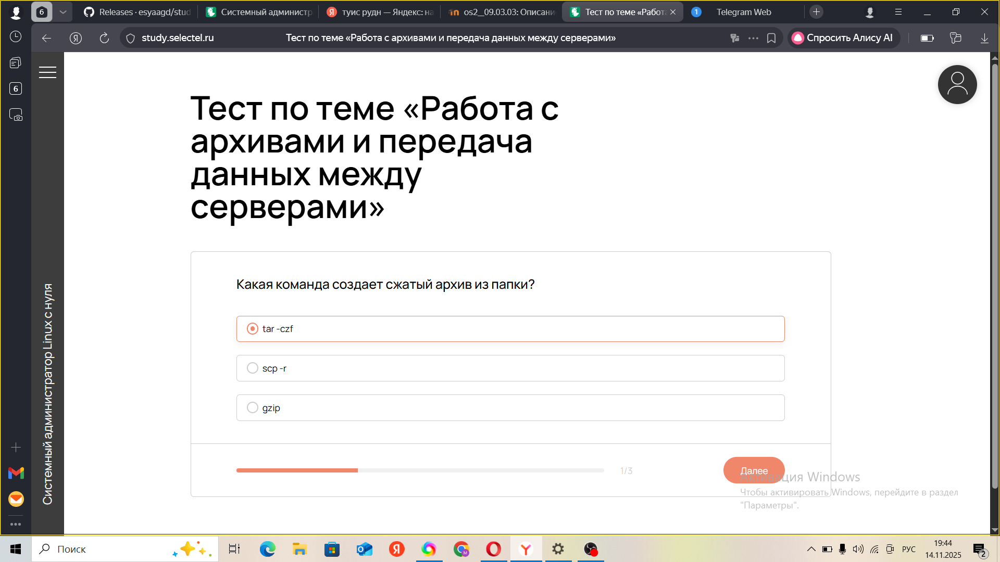
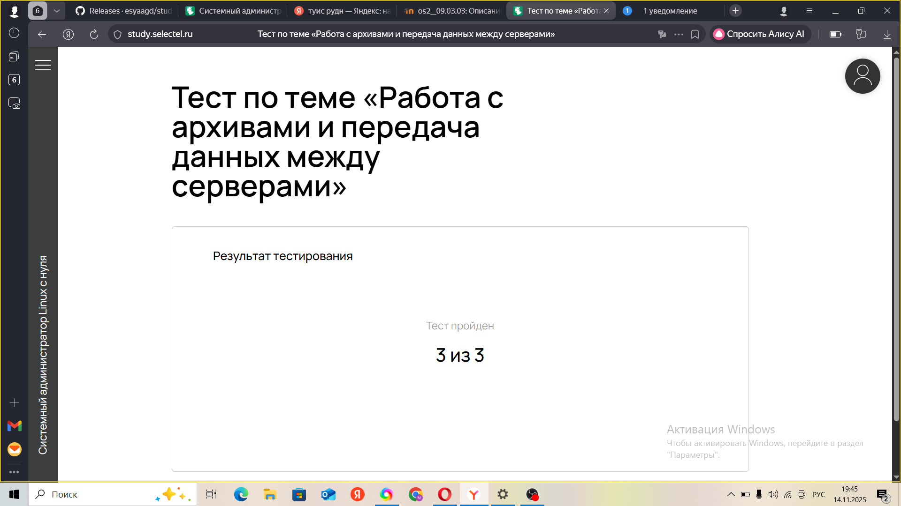

---
## Front matter
title: "Отчёт по внешнему курсу часть 1"
subtitle: "Системный администратор Linux с нуля"
author: "Агджабекова Эся Рустамовна"

## Generic otions
lang: ru-RU
toc-title: "Содержание"

## Bibliography
bibliography: bib/cite.bib
csl: pandoc/csl/gost-r-7-0-5-2008-numeric.csl

## Pdf output format
toc: true
toc-depth: 2
lof: true
lot: true
fontsize: 12pt
linestretch: 1.5
papersize: a4
documentclass: scrreprt
## I18n polyglossia
polyglossia-lang:
  name: russian
  options:
    - spelling=modern
    - babelshorthands=true
polyglossia-otherlangs:
  name: english
## I18n babel
babel-lang: russian
babel-otherlangs: english
## Fonts
mainfont: IBM Plex Serif
romanfont: IBM Plex Serif
sansfont: IBM Plex Sans
monofont: IBM Plex Mono
mathfont: STIX Two Math
mainfontoptions: Ligatures=Common,Ligatures=TeX,Scale=0.94
romanfontoptions: Ligatures=Common,Ligatures=TeX,Scale=0.94
sansfontoptions: Ligatures=Common,Ligatures=TeX,Scale=MatchLowercase,Scale=0.94
monofontoptions: Scale=MatchLowercase,Scale=0.94,FakeStretch=0.9
mathfontoptions:
## Biblatex
biblatex: true
biblio-style: "gost-numeric"
biblatexoptions:
  - parentracker=true
  - backend=biber
  - hyperref=auto
  - language=auto
  - autolang=other*
  - citestyle=gost-numeric
## Pandoc-crossref LaTeX customization
figureTitle: "Рис."
tableTitle: "Таблица"
listingTitle: "Листинг"
lofTitle: "Список иллюстраций"
lotTitle: "Список таблиц"
lolTitle: "Листинги"
## Misc options
indent: true
header-includes:
  - \usepackage{indentfirst}
  - \usepackage{float}
  - \floatplacement{figure}{H}
---

# Цель работы

Выполнить курс Системный администратор Linux с нуля.

# Ход выполнения работы

## Часть 1

1. Тест по теме роль системного адмистратора Linux. (см. рис. [@fig:001]).  

   { #fig:001 }

2.  Тест по теме роль системного адмистратора Linux.см .рис. [@fig:002]).
   { #fig:002 }

3. Тест по теме роль системного адмистратора Linux. (см. рис. [@fig:003]).  

   { #fig:003  }

4. Тест по теме роль системного адмистратора Linux. (см. рис. [@fig:004]).  

   { #fig:004 }

5. Тест по теме вводный урок.  (см. рис. [@fig:005]).  

   { #fig:005 }

6.  Тест по теме вводный урок. (см. рис. [@fig:006]).  

   { #fig:006 }

7. Тест по теме ввводный урок. (см. рис. [@fig:007]).  

   { #fig:007 }

8. Тест по теме ввводный урок. (см. рис. [@fig:008]).  

   { #fig:008 }

9.Тест по теме роль командной стоки в серверной среде. (см. рис. [@fig:009]).  

   { #fig:009 }
  
10. Тест по теме роль командной стоки в серверной среде. (см. рис. [@fig:010]).  

   { #fig:010 }

11. Тест по теме роль командной стоки в серверной среде. (см. рис. [@fig:011]).  

   { #fig:011 }

12. Тест по теме роль командной стоки в серверной среде. см .рис. [@fig:012]).
  
   { #fig:012 }

13. Тест по теме файловая структура и ключевые каталоги. (см. рис. [@fig:013]).  

   { #fig:013 }

14. Тест по теме файловая структура и ключевые каталоги. (см. рис. [@fig:014]).  

   { #fig:014 }

15.  Тест по теме файловая структура и ключевые каталоги.  (см. рис. [@fig:015]).  

   { #fig:015 width=70% }

16.  Тест по теме файловая структура и ключевые каталоги. (см. рис. [@fig:016]).  

   { #fig:016 }

17.Тест по теме Принцип Все есть файл (см. рис. [@fig:017]).  

   { #fig:017 }

18. Тест по теме Принцип Все есть файл (см. рис. [@fig:018]).  

   { #fig:018 }

19.Тест по теме Принцип Все есть файл (см. рис. [@fig:019]).  

   { #fig:019 }
  
20. Тест по теме роль командной стоки в серверной среде. (см. рис. [@fig:020]).  

   { #fig:020 }

21. Тест по теме Работа с базовымы командами в реальных условиях. (см. рис. [@fig:021]).  

   { #fig:021 }

22.  Тест по теме Работа с базовымы командами в реальных условиях. .рис. [@fig:022]).
  
   { #fig:022 }

23. Тест по теме Работа с базовымы командами в реальных условиях. (см. рис. [@fig:023]).  

   { #fig:023  }

24. Тест по теме Работа с базовымы командами в реальных условиях. (см. рис. [@fig:024]).  

   { #fig:024 }

25.  Тест по теме Работа с базовымы командами в реальных условиях.  (см. рис. [@fig:025]).  

   { #fig:025 }

26.  Тест по теме Работа с базовымы командами в реальных условиях. (см. рис. [@fig:026]).  

   { #fig:026 }

27. Тест по теме Работа с архивами и передачей данных с серверами. (см. рис. [@fig:027]).  

   { #fig:027 }

28. Тест по теме Работа с архивами и передачей данных с серверами. (см. рис. [@fig:028]).  

   { #fig:028 }

29.Тест по теме Работа с архивами и передачей данных с серверами. (см. рис. [@fig:029]).  

   { #fig:029 }
  
30. Тест по теме Работа с архивами и передачей данных с серверами. (см. рис. [@fig:030]).  

   { #fig:030 }

31. Тест по теме основы автоматизации с помощью Bash-скриптов. (см. рис. [@fig:031]).  

   { #fig:031 }

32. Тест по теме основы автоматизации с помощью Bash-скриптов. см .рис. [@fig:032]).
  
   { #fig:032 }

33. Тест по теме основы автоматизации с помощью Bash-скриптов. (см. рис. [@fig:033]).  

   { #fig:033 }

34. Тест по теме основы автоматизации с помощью Bash-скриптов. (см. рис. [@fig:034]).  

   { #fig:034 }

# Заключение

В ходе выполнения 1 части курса Системный администратор Linux с нулябыли изучены основные принципы работы Linux
В результате работы получены практические навыки администрирования и конфигурирования Linux, необходимых для обеспечения безопасности и стабильности работы системы.
