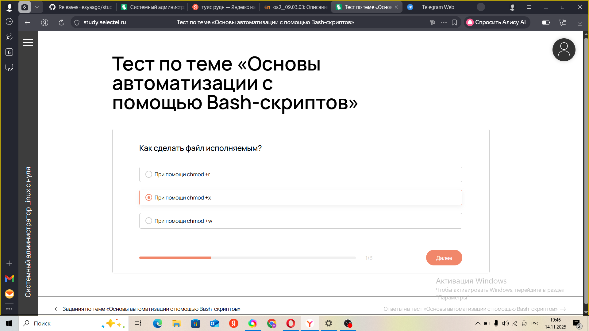
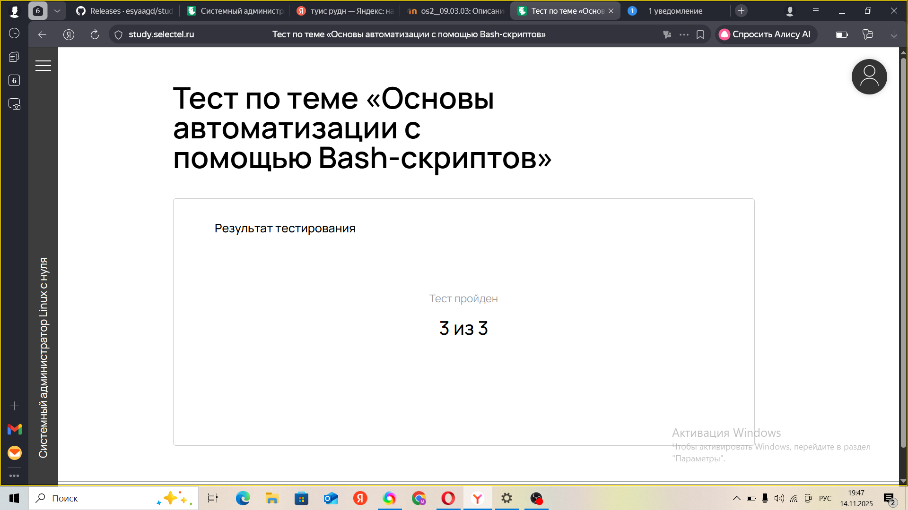

---
## Front matter
lang: ru-RU
title: Презентация по прохождению курса Системный администратор Linux с нуля
subtitle: часть1
author:
  - Агджабекова Эся Рустамовна
institute:
  - Российский университет дружбы народов, Москва, Россия
date: 20 ноября 2025

## i18n babel
babel-lang: russian
babel-otherlangs: english

## Formatting pdf
toc: false
slide_level: 2
aspectratio: 169
section-titles: true
theme: metropolis
header-includes:
 - \metroset{progressbar=frametitle,sectionpage=progressbar,numbering=fraction}
---

# Цель работы

пройти курс

# Ход выполнения работы

## Тест по теме роль системного адмистратора Linux.
  
   { #fig:001 width=70% }

## Тест по теме вводный урок.
  
   { #fig:002 width=70% }

## Тест по теме роль командной стоки в серверной среде
  
   { #fig:003 width=70% }

## Тест по теме файловая структура и ключевые каталоги.
 
   { #fig:004 width=70% }

## Тест по теме Принцип Все есть файл
  
   { #fig:005 width=70% }
## Тест по теме роль командной стоки в серверной среде. 

   { #fig:006 width=70% }

## Тест по теме Работа с базовымы командами в реальных условиях.
  

   { #fig:007 width=70% }

## Тест по теме Работа с архивами и передачей данных с серверами.
 

   { #fig:008 width=70% }

## Тест по теме основы автоматизации с помощью Bash-скриптов.

   { #fig:009 width=70% }

# Заключение

В ходе выполнения 1 части курса Системный администратор Linux с нулябыли изучены основные принципы работы Linux
В результате работы получены практические навыки администрирования и конфигурирования Linux, необходимых для обеспечения безопасности и стабильности работы системы.
1. Тест по теме роль системного адмистратора Linux. (см. рис. [@fig:001]).  

   { #fig:001 }

2.  Тест по теме роль системного адмистратора Linux.см .рис. [@fig:002]).
   { #fig:002 }

3. Тест по теме роль системного адмистратора Linux. (см. рис. [@fig:003]).  

   { #fig:003  }

4. Тест по теме роль системного адмистратора Linux. (см. рис. [@fig:004]).  

   { #fig:004 }

5. Тест по теме вводный урок.  (см. рис. [@fig:005]).  

   { #fig:005 }

6.  Тест по теме вводный урок. (см. рис. [@fig:006]).  

   { #fig:006 }

7. Тест по теме ввводный урок. (см. рис. [@fig:007]).  

   { #fig:007 }

8. Тест по теме ввводный урок. (см. рис. [@fig:008]).  

   { #fig:008 }

9.Тест по теме роль командной стоки в серверной среде. (см. рис. [@fig:009]).  

   { #fig:009 }
  
10. Тест по теме роль командной стоки в серверной среде. (см. рис. [@fig:010]).  

   { #fig:010 }

11. Тест по теме роль командной стоки в серверной среде. (см. рис. [@fig:011]).  

   { #fig:011 }

12. Тест по теме роль командной стоки в серверной среде. см .рис. [@fig:012]).
  
   { #fig:012 }

13. Тест по теме файловая структура и ключевые каталоги. (см. рис. [@fig:013]).  

   { #fig:013 }

14. Тест по теме файловая структура и ключевые каталоги. (см. рис. [@fig:014]).  

   { #fig:014 }

15.  Тест по теме файловая структура и ключевые каталоги.  (см. рис. [@fig:015]).  

   { #fig:015 width=70% }

16.  Тест по теме файловая структура и ключевые каталоги. (см. рис. [@fig:016]).  

   { #fig:016 }

17.Тест по теме Принцип Все есть файл (см. рис. [@fig:017]).  

   { #fig:017 }

18. Тест по теме Принцип Все есть файл (см. рис. [@fig:018]).  

   { #fig:018 }

19.Тест по теме Принцип Все есть файл (см. рис. [@fig:019]).  

   { #fig:019 }
  
20. Тест по теме роль командной стоки в серверной среде. (см. рис. [@fig:020]).  

   { #fig:020 }

21. Тест по теме Работа с базовымы командами в реальных условиях. (см. рис. [@fig:021]).  

   { #fig:021 }

22.  Тест по теме Работа с базовымы командами в реальных условиях. .рис. [@fig:022]).
  
   { #fig:022 }

23. Тест по теме Работа с базовымы командами в реальных условиях. (см. рис. [@fig:023]).  

   { #fig:023  }

24. Тест по теме Работа с базовымы командами в реальных условиях. (см. рис. [@fig:024]).  

   { #fig:024 }

25.  Тест по теме Работа с базовымы командами в реальных условиях.  (см. рис. [@fig:025]).  

   { #fig:025 }

26.  Тест по теме Работа с базовымы командами в реальных условиях. (см. рис. [@fig:026]).  

   { #fig:026 }

27. Тест по теме Работа с архивами и передачей данных с серверами. (см. рис. [@fig:027]).  

   { #fig:027 }

28. Тест по теме Работа с архивами и передачей данных с серверами. (см. рис. [@fig:028]).  

   { #fig:028 }

29.Тест по теме Работа с архивами и передачей данных с серверами. (см. рис. [@fig:029]).  

   { #fig:029 }
  
30. Тест по теме Работа с архивами и передачей данных с серверами. (см. рис. [@fig:030]).  

   { #fig:030 }

31. Тест по теме основы автоматизации с помощью Bash-скриптов. (см. рис. [@fig:031]).  

   { #fig:031 }

32. Тест по теме основы автоматизации с помощью Bash-скриптов. см .рис. [@fig:032]).
  
   { #fig:032 }

33. Тест по теме основы автоматизации с помощью Bash-скриптов. (см. рис. [@fig:033]).  

   { #fig:033 }

34. Тест по теме основы автоматизации с помощью Bash-скриптов. (см. рис. [@fig:034]).  

   { #fig:034 }

# Заключение

В ходе выполнения 1 части курса Системный администратор Linux с нулябыли изучены основные принципы работы Linux
В результате работы получены практические навыки администрирования и конфигурирования Linux, необходимых для обеспечения безопасности и стабильности работы системы.

